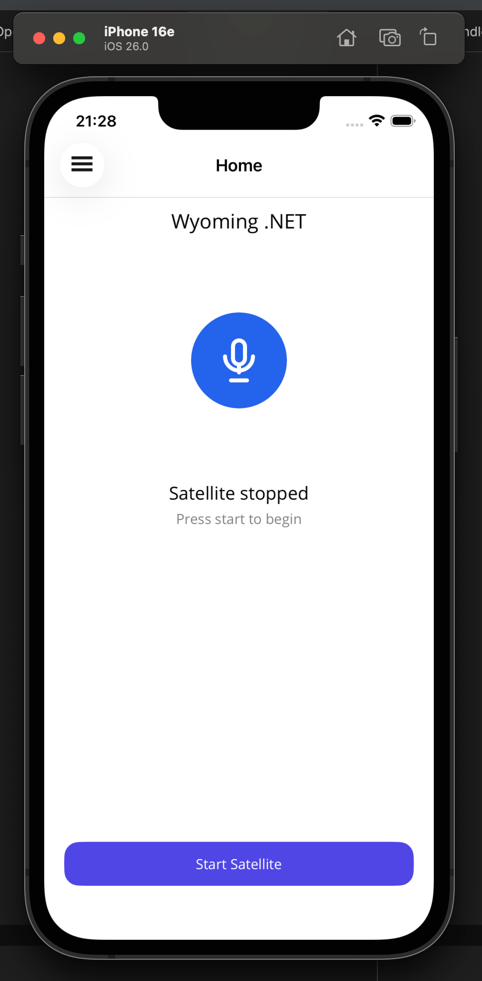
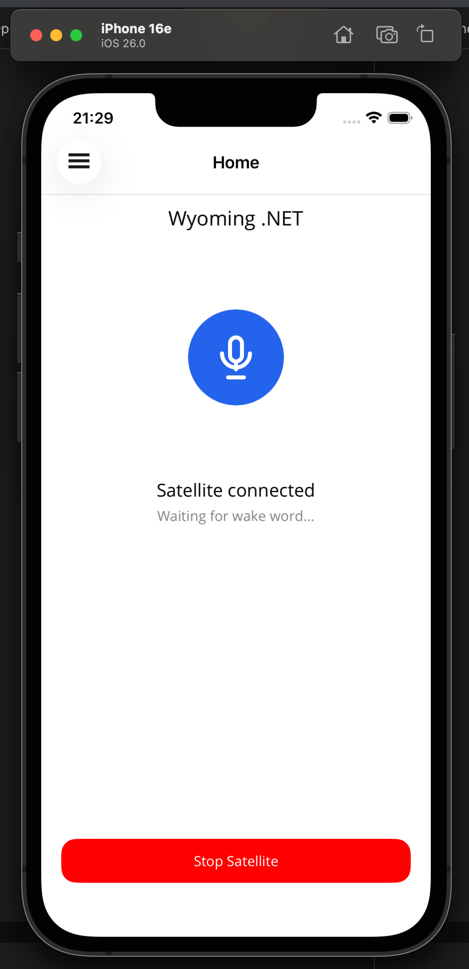
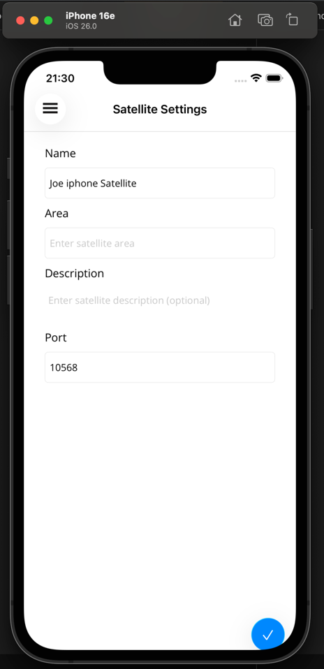
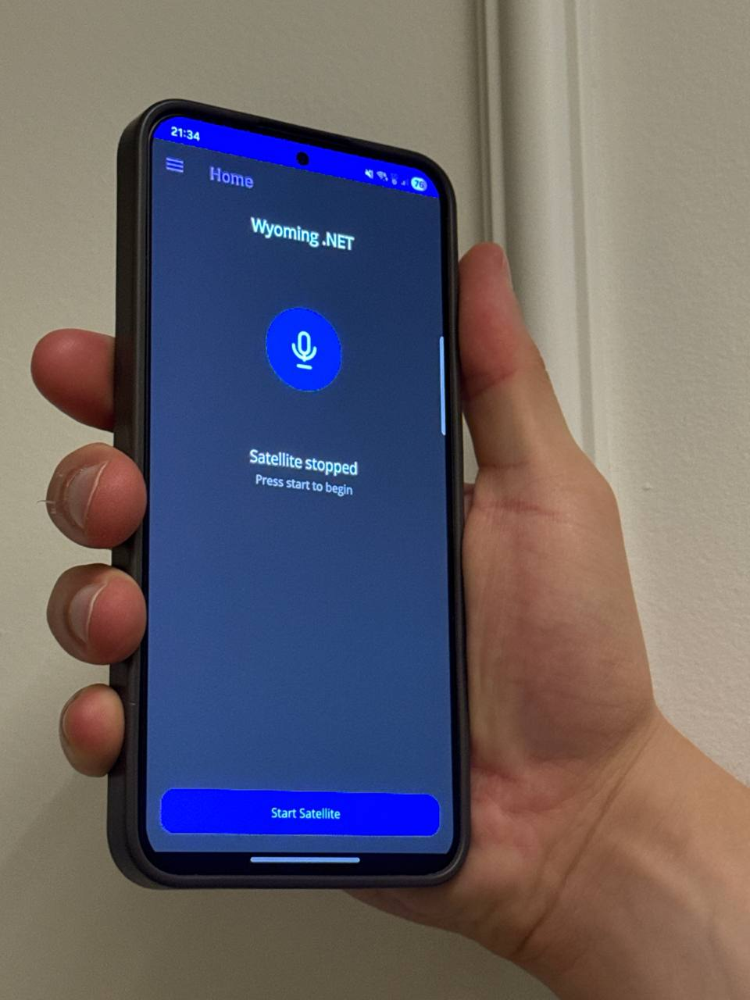

# Wyoming .NET

A cross-platform voice assistant satellite built on the [Wyoming protocol](https://github.com/rhasspy/wyoming), designed to integrate with Home Assistant.
This project allows you to turn almost any device into a Wyoming satellite.

---

## Supported Platforms

- Android
- iOS
- Windows
- Linux
- macOS
- Tizen (TV)

---

## Tested Devices

### Android
- Samsung Galaxy S23+

### iOS
- iPhone 15 Pro
- iPad

### Windows
- Windows 11

### macOS
- MacBook M4 Pro
- Mac Mini M4

### Tizen
- Samsung The Frame TV

---

## Wake Word

Wake word detection is powered by **OpenWakeWord**.

Currently supported wake words:
- Alexa  

> Note: Automatic model download is not implemented yet.

---

## Environment Setup

### Android / iOS / Windows / Linux / macOS

I recommend following this setup guide:

https://www.youtube.com/watch?v=PrlsBboV-dY

Once your environment is configured, you should be able to deploy the app directly to your device using Rider (or your preferred IDE).

---

### Tizen Setup (Windows Recommended)

Tizen development is currently recommended on:

- ✅ Windows  
- ⚠️ macOS (not tested)

#### Recommended Setup

1. Install **Tizen Studio**
2. Install the **.NET Tizen workload**
3. Install the **VS Code Tizen extension**
4. Enable **Developer Mode** on your TV
5. Deploy using SDB or network connection

---

## Architecture

Wyoming.NET is structured in layers to keep the core protocol, satellite engine, and platform-specific implementations cleanly separated.

### Project Structure

- **Wyoming.Net.Core**  
  Base implementation of the Wyoming protocol.  
  Contains shared protocol logic and primitives used across all projects.

- **Wyoming.Net.Satellite**  
  The main satellite engine.  
  Handles:
    - Audio streaming
    - Wake word flow
    - TTS/STT communication
    - Connection lifecycle
    - Core assistant logic

  Most of the runtime engine lives here.

- **Wyoming.Net.Satellite.App.Maui**  
  Shared .NET MAUI application layer (UI + shared app logic).

- **Wyoming.Net.Satellite.App.Droid**
- **Wyoming.Net.Satellite.App.iOS**
- **Wyoming.Net.Satellite.App.MacCatalyst**

  Platform-specific MAUI entry points.  
  These host the shared MAUI app and provide native bindings when needed.

- **Wyoming.Net.Satellite.App.Tizen**  
  Tizen implementation.  
  Uses `Core` and `Satellite`, but has its own UI layer instead of MAUI.

- **Wyoming.Net.Tts**  
  Built-in TTS server implementation.

- **Wyoming.Net.Tts.KokoroBackend**  
  Kokoro backend for the TTS server.

---

## Layered Design

The system follows a layered architecture:

Core (Protocol) 
↓ 
Satellite (Engine) 
↓ 
Platform Edge Layer (Devices)

### Core

Responsible only for the Wyoming protocol implementation and shared abstractions.

### Satellite (Engine Layer)

The Satellite project contains most of the assistant runtime logic:

- Wake word pipeline
- Audio buffering
- Streaming to Home Assistant
- TTS playback handling
- Session state
- Dependency injection entry points

This layer is platform-agnostic.

### Platform Edge Layer

Each platform implements hardware-specific functionality such as:

- Microphone access
- Speaker output
- Audio session configuration
- Device lifecycle
- Background execution
- Inference runtime (when required)

These implementations are injected into the Satellite engine using **Dependency Injection**, keeping the engine clean and portable.

---

## Inference Runtime

Wake word inference runs using:

- **ONNX Runtime** on:
    - Android
    - iOS
    - Windows
    - Linux
    - macOS

- **Tizen SingleShot Engine** on:
    - Tizen

Tizen uses its native inference engine instead of ONNX due to platform constraints.

---

## Design Principles

- Clear separation of concerns
- Platform-agnostic core engine
- Thin device-specific edge layers
- Dependency injection for portability
- Modular backend support (TTS/STT)

This makes it easy to:
- Add new platforms
- Swap inference backends
- Embed additional services (TTS/STT)
- Extend the assistant without breaking platform code

## License

MIT license

## Roadmap

### Core Features
- [ ] Silent mode
- [ ] Upload custom WAV files for wake word detection
- [x] Improve UI
- [x] Support different TTS models
- [ ] Support different wake word models
- [ ] Background mode
- [ ] Auto discovery (zeroconf)
- [ ] Noise suppression
    - [ ] Energy gate + WebRTC pre-validations

---

### Platform Support
- [x] Tizen
- [x] Windows
- [ ] Linux
- [x] macOS

---

### Performance & Code Quality
- [ ] Review all `ConfigureAwait(false)` usage
- [ ] Review memory allocation
- [ ] Review CPU usage and battery consumption

---

### Built-in Servers

#### TTS Server in Wyoming.NET
- [x] Kokoro backend
- [ ] OpenAI backend
- [ ] pt-BR support
- [ ] Improve phoneme algorithm
- [ ] Markdown cleaning

#### STT Server in Wyoming.NET
- [ ] Built-in STT server implementation

---

### Distribution
- [ ] Publishing / distribution pipeline
    - [ ] Publish to Apple Store
    - [ ] Publish to Play Store
    - [ ] Publish to Tizen

[Tizen TV](docs/assets/tv.mp4)